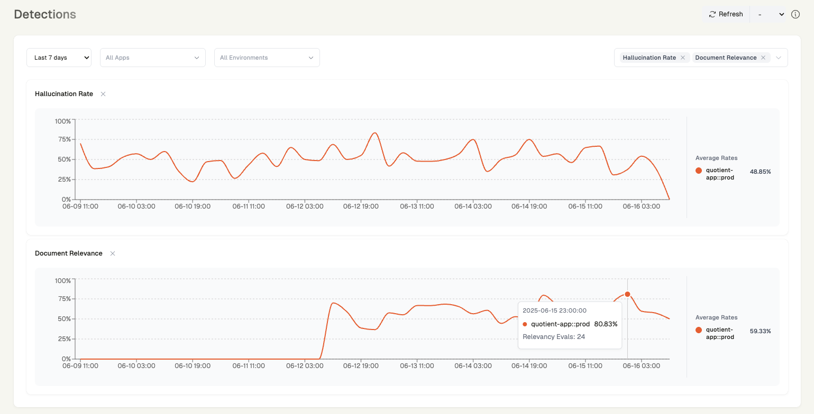

  

  

  
  
  
  

  <a href="https://app.quotientai.co">App</a> •
  <a href="https://docs.quotientai.co">Docs</a> •
  <a href="https://blog.quotientai.co">Blog</a> •
  <a href="https://discord.com/invite/YeJzANpntv">Discord</a>

  <em><a href="https://app.quotientai.co">Try Quotient Now (Free)</a></em>

------

This repository contains cookbooks and examples demonstrating how to monitor and evaluate AI systems for hallucinations, retrieval quality, and other reliability issues using [Quotient AI](https://www.quotientai.co/).

## What You Can Do

- **Build and Monitor AI Agents**: Track LangChain agents in real-time
- **Evaluate Search Quality**: Automatically detect when AI search results contain unsupported claims
- **Improve AI Reliability**: Get insights into common failure patterns and how to fix them
- **Production Monitoring**: Set up automated monitoring for your AI applications

## Getting Started
Visit [app.quotientai.co](https://app.quotientai.co), sign up for a free account, and grab an API key from Settings. **Quotient is completely free to get started!** Check out the [pricing page](https://www.quotientai.co/pricing) for details on free tier limits and paid plans.

## Cookbooks

| Notebook | Description | Open | Resources |
|----------|-------------|------|-----------|
| [Evaluate AI Search Quality with Tavily](cookbooks/search/tavily/tavily-quotient-detections.ipynb) | This notebook demonstrates how to use Quotient to detect hallucinations and document relevancy in search results using Tavily. | [Open Notebook](cookbooks/search/tavily/tavily-quotient-detections.ipynb) | [Tavily](https://github.com/tavily-ai), [Quotient](https://github.com/quotient-ai) |
| [Evaluate AI Search Quality with Exa](cookbooks/search/exa/exa-quotient-detections.ipynb) | This notebook demonstrates how to use Quotient to detect hallucinations and document relevancy in search results using Exa `/answer`. | [Open Notebook](cookbooks/search/exa/exa-quotient-detections.ipynb) | [Exa](https://exa.ai), [Quotient](https://github.com/quotient-ai) |
| [Build and Monitor a Web Research Agent](cookbooks/agents/research/tavily-quotient-agent.ipynb) | This notebook demonstrates how to use Quotient to monitor and evaluate a research agent that browses the web and answers questions using the Tavily API. | [Open Notebook](cookbooks/agents/research/tavily-quotient-agent.ipynb) | [Langchain](https://github.com/langchain-ai/langchain), [Tavily](https://github.com/tavily-ai), [OpenAI](https://github.com/OPENAI), [Quotient](https://github.com/quotient-ai) |

## Contributing
This repository contains research and examples for AI reliability. Feel free to:
- Run the notebooks and share your results
- Report issues or suggest improvements
- Contribute new examples or use cases

## Additional Resources

- [Quotient Documentation](https://docs.quotientai.co/)
- [Quotient App](https://app.quotientai.co/)
- [Quotient Blog](https://blog.quotientai.co/)

**You can reach the Quotient team at research@quotientai.co**
