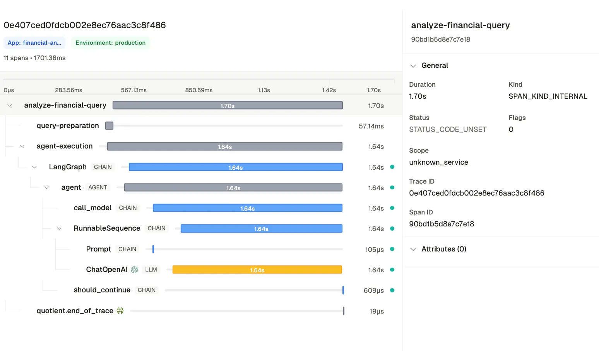

# Financial AI Agent with Quotient Traces

This example showcases a production-ready financial analysis agent that demonstrates:
- Real-time stock data retrieval and analysis
- Comprehensive monitoring with [Quotient](https://quotientai.co)

## Requirements

Install the necessary libraries before running the file:

```bash
pip install quotientai>=0.4.6 langchain-openai>=0.1.0 langgraph>=0.1.6 openinference-instrumentation-langchain>=0.1.1 yfinance>=0.2.28 python-dotenv>=1.0.0
```

## Environment Setup

You need to set the following environment variables:
- `QUOTIENT_API_KEY`
- `OPENAI_API_KEY`

These can be set in a `.env` file in the project root or as system environment variables.

## Running the Agent

The agent can be run directly from the command line:

```bash
python agent.py
```

By default, it will run analysis on three example queries:
1. "What's Apple's current stock price and 1-month return?"
2. "Compare Microsoft and Google P/E ratios"
3. "What's Tesla's ESG score and sustainability initiatives?"

The agent will:
- Execute each query with comprehensive tracing
- Display formatted results including responses and trace metrics
- Automatically detect potential hallucinations and measure retrieved source relevance.

## Quotient Traces

This agent uses Quotient's tracing system to provide comprehensive monitoring and quality control



### Features
- **Comprehensive Tracing**: Every operation is traced, from query preparation to tool execution
- **Real-time Monitoring**: All traces are available instantly in the Quotient dashboard
- **Document Relevance**: Measures how relevant retrieved information is to the query
- **Hallucination Detection**: Automatically identifies when the agent makes claims without data support

### Accessing Traces with Detections
1. **Programmatically**:
```python
trace = quotient.traces.get(trace_id='<trace-id>')
```

2. **Dashboard**:
- View all traces at https://app.quotientai.co/traces