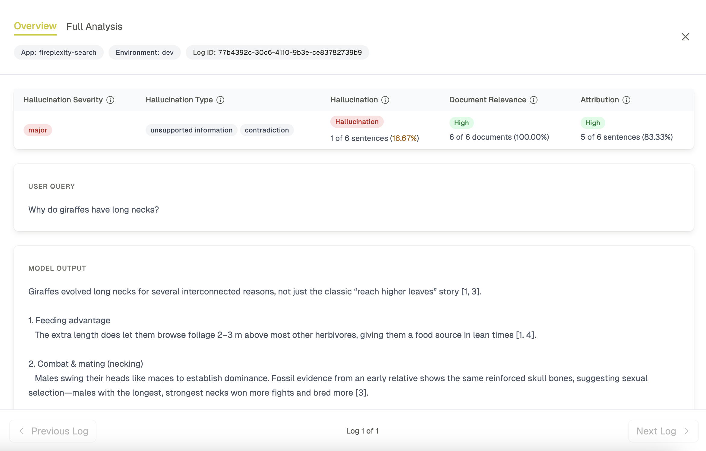
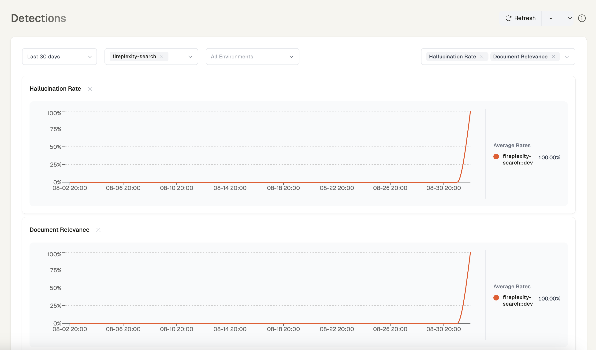

# Fireplexity v2 with Quotient Monitoring

This is a fork of [Fireplexity](https://github.com/mendableai/fireplexity) enhanced with Quotient monitoring for hallucination detection and context relevance analysis. The original AI search engine capabilities (web, news, and images) are preserved while adding robust monitoring and quality checks.


## Features

- Real-time search across web, news, and images
- Context relevance analysis for search results and hallucination detection powered by Quotient






## Setup

```bash
git clone https://github.com/quotient-ai/quotient-cookbooks.git
cd quotient-cookbooks/cookbooks/search/firecrawl/fireplexity
npm install
```

## Configure

```bash
cp .env.example .env.local
```

Add your keys to `.env.local`:
```
FIRECRAWL_API_KEY=fc-your-api-key
GROQ_API_KEY=gsk_your-groq-api-key
QUOTIENT_API_KEY=your-quotient-api-key
```

## Run

```bash
npm run dev
```

Open http://localhost:3000

## Deploy

[](https://vercel.com/new/clone?repository-url=https://github.com/quotient-ai/quotient-cookbooks/tree/main/cookbooks/search/firecrawl/fireplexity)

## Get API Keys

- [Firecrawl](https://firecrawl.dev)
- [Groq](https://groq.com)
- [Quotient](https://quotientai.co)

## Monitoring

The application uses Quotient to monitor and analyze search results and AI responses:

- **Context Relevance**: Evaluates how well search results match the user's query
- **Hallucination Detection**: Automatically identifies potential inaccuracies in AI responses
- **Analytics Dashboard**: View detailed metrics and logs in the Quotient dashboard


MIT License
