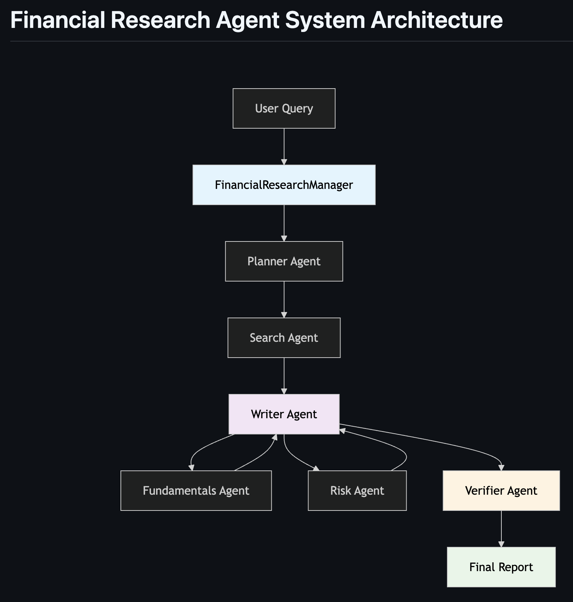
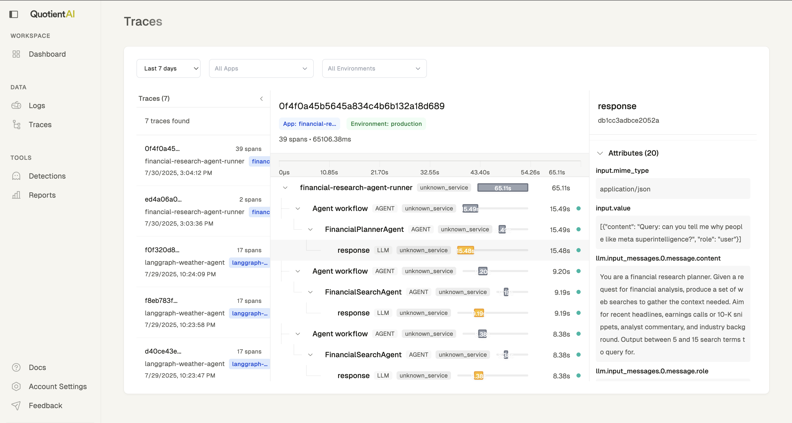

# Financial Research Agent Example

**NOTE:** This example is pulled and adapted from the OpenAI Agents SDK Examples [here](https://github.com/openai/openai-agents-python/tree/main/examples/financial_research_agent).

---------

## Agent Architecture

This example shows how you can compose a financial research agent using the OpenAI Agents SDK, and trace the execution of the agent using [Quotient Tracing](https://docs.quotientai.co/data-collection/traces). This example uses specialized sub‑agents and a verification step.

The flow is:

1. **Planning**: A planner agent turns the end user’s request into a list of search terms relevant to financial analysis – recent news, earnings calls, corporate filings, industry commentary, etc.
2. **Search**: A search agent uses the built‑in `WebSearchTool` to retrieve terse summaries for each search term. (You could also add `FileSearchTool` if you have indexed PDFs or 10‑Ks.)
3. **Sub‑analysts**: Additional agents (e.g. a fundamentals analyst and a risk analyst) are exposed as tools so the writer can call them inline and incorporate their outputs.
4. **Writing**: A senior writer agent brings together the search snippets and any sub‑analyst summaries into a long‑form markdown report plus a short executive summary.
5. **Verification**: A final verifier agent audits the report for obvious inconsistencies or missing sourcing.



## Quickstart

1. Install the dependencies:

```
pip install quotientai openai-agents openinference-instrumentation-openai-agents
```

2. Setup your API Keys:

Get your OpenAI API Key from https://platform.openai.com/
```
export OPENAI_API_KEY=your_api_key
```

Get your Quotient API Key from https://app.quotientai.co/ -> Click `Settings`
```
export QUOTIENT_API_KEY=your_api_key
```

3. Run the agent:

```bash
python -m openai_financial_research_agent.main
```

4. Enter a query like:

```
Write up an analysis of Apple Inc.'s most recent quarter.
```

5. Wait for the agent to complete and view the trace in the [Quotient Web UI](https://app.quotientai.co/traces).




### Starter prompt

The writer agent is seeded with instructions similar to:

```
You are a senior financial analyst. You will be provided with the original query
and a set of raw search summaries. Your job is to synthesize these into a
long‑form markdown report (at least several paragraphs) with a short executive
summary. You also have access to tools like `fundamentals_analysis` and
`risk_analysis` to get short specialist write‑ups if you want to incorporate them.
Add a few follow‑up questions for further research.
```

You can tweak these prompts and sub‑agents to suit your own data sources and preferred report structure.
